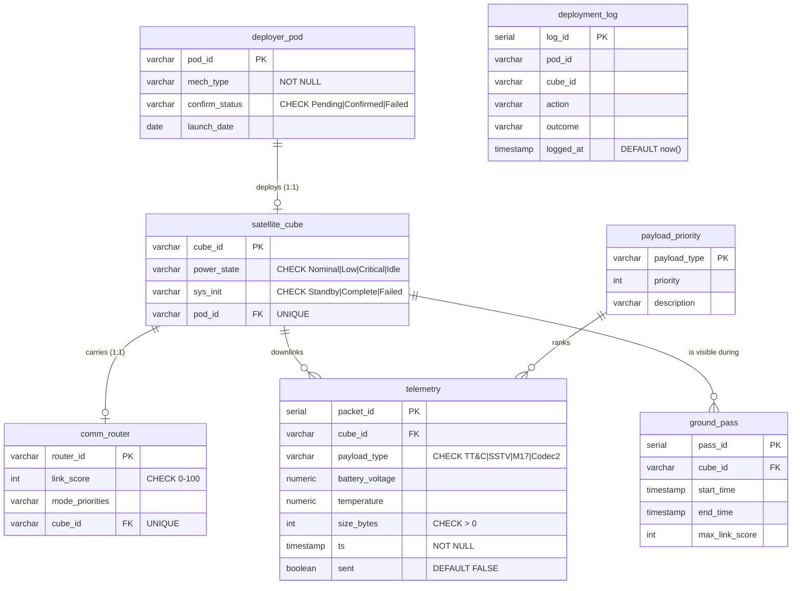
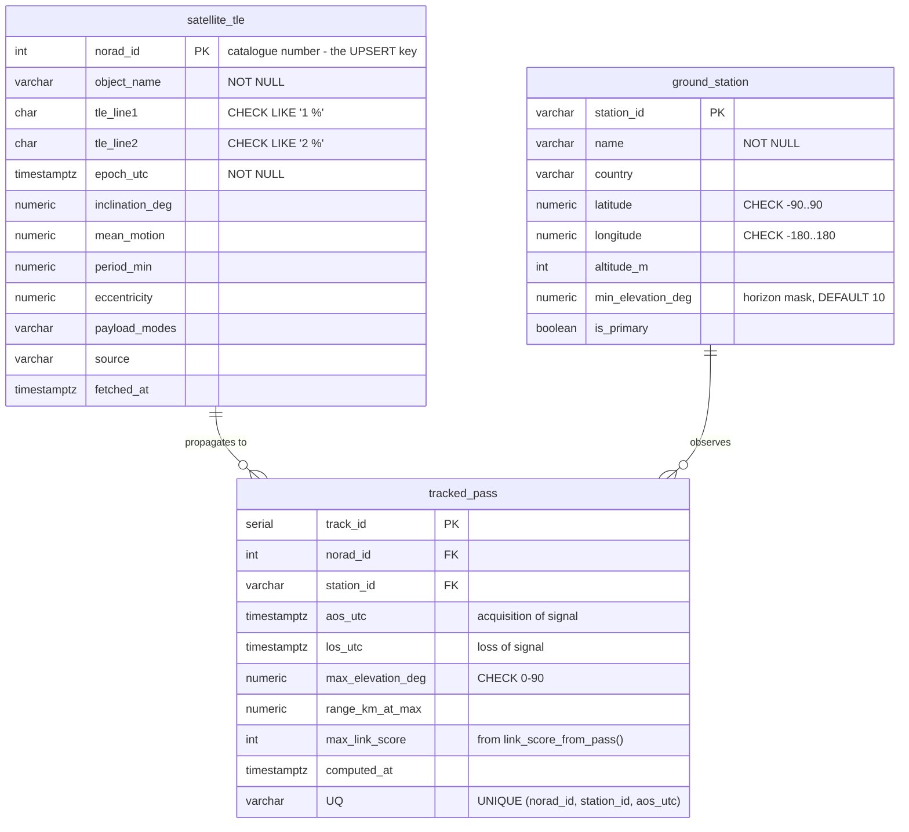

# SomaiyaSat Ground Control

A PostgreSQL mission database with two front ends — a scroll-driven landing page and a
Streamlit mission-control dashboard — built for the SY B.Tech IT DBMS course around
college AI use case **KJS-SRS-01**.

**SomaiyaSat** is a PocketQube deployed by the **SomaiyaPod** deployer. It is only in
view of the ground station for a few minutes at a time, and an onboard AI router has to
decide live what to spend that window on: housekeeping (TT&C) first, then SSTV imagery,
then M17/Codec2 voice. The use case requires that router to have a **rule-based fallback
that is safe and explainable**. This project implements that fallback in SQL.

> **The database is the project.** Every feature — the routing rules, the transactions,
> the permissions, the aggregation — lives in PostgreSQL. Python opens a connection,
> calls the SQL, and renders what comes back. There is no business logic in the app and
> no permission check in Python: if a role cannot do something, it is PostgreSQL that
> refuses it.

---

## Setup

**Requires** PostgreSQL 16+ running locally, Python 3.10+, and Node 20+ (for the
landing page only — the dashboard runs without it).

```bash
cd somaiyasat-ground-control

python3 -m venv .venv && source .venv/bin/activate
pip install -r requirements.txt

cp .env.example .env         # then edit PGPASSWORD and the three role passwords

python scripts/setup_db.py            # drops & recreates space_deploy, runs sql/01–05
python scripts/generate_telemetry.py  # ~5000 telemetry packets over the last 7 days

python scripts/fetch_tles.py          # real orbital elements from CelesTrak
python scripts/predict_passes.py      # SGP4 → real pass windows over the stations

cd landing && npm install && cd ..    # landing-page dependencies (one time)
python scripts/prepare_assets.py      # NASA Earth textures + land mask (one time)

python run.py                         # builds, serves, and opens everything
```

`run.py` builds the landing page if needed, exports `stats.json`, serves the landing page
on **:5500**, starts Streamlit on **:8501**, and opens your browser. Ctrl+C stops both.

| flag | effect |
|---|---|
| `--no-build` | never rebuild the landing page |
| `--rebuild` | always rebuild, even if `dist` looks fresh |
| `--no-open` | do not open a browser |
| `--mock` | ignore the database and use mock stats |

To run just the dashboard: `streamlit run app/Home.py`.
To work on the landing page with hot reload: `cd landing && npm run dev` (:5173).

Then log in as one of the three roles.

| role | password (from `.env`) | can do |
|---|---|---|
| `ground_operator` | `GROUND_OPERATOR_PASSWORD` | everything — full DML + EXECUTE |
| `student_analyst` | `STUDENT_ANALYST_PASSWORD` | read-only: views, `telemetry`, `plan_pass` |
| `ai_router` | `AI_ROUTER_PASSWORD` | INSERT on `telemetry`, read `comm_router` / `payload_priority` |

> **The passwords in `.env.example` are throwaway defaults** (`ground123`, `student123`,
> `router123`) so the project runs the moment you clone it. They are for a local,
> disposable database only. Change them in your own `.env` and re-run
> `python scripts/setup_db.py` before this touches any machine you care about. Your real
> `.env` is gitignored and never committed.

`setup_db.py` is idempotent — re-run it any time to get back to a clean state. It
substitutes the role passwords from `.env` into `sql/05_roles.sql`, so no secret is ever
committed.

`sql/06_indexes.sql` is **not** applied by setup. The Index Benchmark page applies and
drops it at runtime so the before/after comparison is live.

> **Password authentication must actually be enforced**, or the login screen proves
> nothing. Check that `pg_hba.conf` uses `scram-sha-256` (not `trust`) for the
> `host … 127.0.0.1/32` and `host … ::1/128` lines, then `SELECT pg_reload_conf();`.

---

## Real satellite tracking

SomaiyaSat has not launched, so it has no orbit to track. What a real mission does
before its own launch is validate the ground segment against satellites that are
already flying — and that is what the tracking half of this project does.

`scripts/fetch_tles.py` downloads current two-line element sets from
[CelesTrak](https://celestrak.org/) for ten amateur-radio satellites and **UPSERTs**
them into `satellite_tle`. `scripts/predict_passes.py` propagates them with SGP4 and
writes real visibility windows into `tracked_pass`. Neither invents anything: the
orbits, the pass times and the elevations are real.

Why these ten. Each is flight heritage for something KJS-SRS-01 proposes:

| Satellite | NORAD | Relevance |
|---|---|---|
| **LILACSAT-2** | 40908 | flew an amateur **Codec2** digital-voice transponder |
| **ISS (ZARYA)** | 25544 | ARISS transmits real **SSTV** from it |
| FUNCUBE-1 (AO-73) | 39444 | long-running amateur telemetry beacon + transponder |
| OSCAR 7 (AO-7) | 7530 | the oldest amateur satellite still worked |
| SO-50, AO-27, BEESAT-1, UWE-4, SONATE-2, MESAT1 | — | university CubeSats in the same orbital regime |

**Note what is missing: none of them flies M17.** That gap is visible in the
`payload_modes` column rather than merely asserted in a write-up — it is the novelty
the use case is aimed at.

### Where the link score comes from

`ground_pass.max_link_score` was authored by hand for the proposed mission. For a real
pass it is **computed**, by `link_score_from_pass(elevation, range)` in
`sql/04_functions.sql`, from the two effects that dominate a LEO amateur link:

- free-space path loss, rising with the square of slant range → `20·log₁₀(range / 500 km)` dB
- extra atmosphere and obstruction near the horizon → `10·log₁₀(1 / sin(elevation))` dB

summed and mapped onto 0–100 across a 30 dB span. That calibration puts a marginal 10°
pass just above the 40-point safe-mode threshold `plan_pass()` already used — so a rule
invented for the demo turns out to fire on exactly the passes a real operator distrusts.
Both halves of the project therefore speak the same 0–100 scale.

### Offline safety

`fetch_tles.py` is the **only** thing in the project that touches the internet, and it
runs ahead of time. It caches every download under `data/tle_cache/` and stores the
elements in the database, so the dashboard itself still makes zero external requests.
`python scripts/fetch_tles.py --offline` reloads from that cache with no network at all.

The browser propagates with `satellite.js`, vendored at
`app/static/vendor/satellite.min.js` alongside `globe.gl`. It agrees with the Python
`sgp4` the database uses to within **0.00004°**, so the globe and the tables never
disagree.

> **A TLE goes stale.** It is a snapshot of an orbit that drifts away from reality over
> days, which is why `v_tracked_fleet` grades every element set FRESH / AGEING / STALE by
> age. Re-run `fetch_tles.py` and `predict_passes.py` before a demo.

---

## The interface

Two front ends, one design system: pure black, white text, a single electric-blue accent
(`#3d6bff`), Inter for text and JetBrains Mono for labels and numbers. Both load their
fonts from local files — nothing is fetched from a CDN, and the whole UI works with the
network disconnected.

### Landing page — `landing/` (:5500)

Vite + React + TypeScript + Tailwind v4 + shadcn/ui, with `@react-three/fiber` for 3D,
GSAP (ScrollTrigger, SplitText, DrawSVG, MotionPath) for animation, and Lenis for smooth
scroll synced to ScrollTrigger.

The page opens on a **spiral intro gate** — a particle field that draws a spiral and then
blooms past the camera, holding until you scroll, swipe or press a key. Textures preload
behind it, so the hero is warm the moment it hands off.

The hero then pins for ~500vh and scrubs four scenes in one canvas: a 40 000-point
constellation Earth sampled from the land mask, a dive to a textured day/night globe with
a fresnel atmosphere, the SomaiyaPod releasing its cube, and a white line-art link diagram
with packets running down the beams in priority order. Below it: the mission statement,
three challenge rows, a pinned Payloads section, the build, an animated architecture
diagram, live counters, a halftone ground-station map, the team rings, and the CTA.

A thin **progress rail** tracks your position down the left gutter. It only appears at
1600px and wider — narrower than that there is no gutter left and it would sit on the
headings.

```bash
cd landing
npm run dev      # hot reload on :5173
npm run build    # type-check + production bundle into dist/
```

### Dashboard — `app/` (:8501)

The five SQL pages are unchanged in behaviour — same queries, same permission model — but
restyled through `app/theme.py`, which injects the palette, the local `@font-face` rules,
the `[ SECTION ]` labels and a shared Plotly template. After login, Home shows a
mission-control globe (`app/components/globe_template.html`, using a locally bundled
globe.gl) with the three deployed cubes on a simulated sun-synchronous orbit, pulsing
ground stations, link-coloured downlink arcs, and a click-through panel per satellite.

The Earth is the real thing — Blue Marble daytime imagery with an elevation bump map, and
city lights on the unlit side. The terminator is driven by the **actual sub-solar point**
for the current UTC time, so it agrees with the clock in the globe's own top bar.

The panel's payload chips mirror `plan_pass()`'s own rules, so SSTV shows as skipped on
CUBE02 with the reason *"battery 6.90V below the 7.2V threshold"* — the same sentence the
SQL function produces.

### Data — `scripts/export_stats.py`

Both front ends read `stats.json`, exported read-only from `v_mission_status`,
`v_cube_health`, `ground_pass` and `telemetry`. **It never fails**: if PostgreSQL or
`.env` is unreachable it writes mock data with an identical shape, and every payload
carries `"source": "database" | "mock"`. The UI never crashes without the database.

### Assets

`scripts/prepare_assets.py` downloads NASA's public-domain Blue Marble, Black Marble and
GEBCO elevation imagery into `landing/public/assets/textures/`, resizes them, and derives
the `land_mask.png` that the point-cloud Earth and the halftone map are both generated
from. Run it once; after that everything is local. NASA is credited in the page footer.

The dashboard serves its own copies from `app/static/textures/` (Streamlit's static
server), so the two front ends never reach across into each other at runtime.

> The use-case PDF (`KJS-SRS-01.pdf`) is not committed here, so the figures in **The
> Build** are original drawings rather than extracted scans — the form-factor drawing is
> built from the dimensions in the document's Fig. 2. Drop the PDF into
> `landing/public/assets/source/` and `prepare_assets.py` will extract the real Fig. 1
> photograph (needs `pymupdf`); nothing in the build depends on it.

### Spacecraft facts used in the copy

Taken from KJS-SRS-01 so the page and the source stay in step:

| | |
|---|---|
| Envelope (Fig. 2) | 127.4 × 57.9 × 57.2 mm — an elongated PCB stack, **not** a 50 mm cube |
| PCB thickness | 1.6 mm · solar cells 42.25 × 22.95 mm |
| Priority order | TT&C / housekeeping → SSTV → Codec2 / M17 |
| Collaborator | ReOrbit, Finland |
| Beneficiaries | Global amateur radio (HAM) community |
| Vertical | Space Technology and Remote Sensing |
| Faculty owners | Dr. Umesh Shinde (Basic Science & Humanities, KJSIT); Dr. Shailesh Nikam (Mechanical Engineering, KJSSE) |

The routing rules exist because the document rates **AI Security & Trustworthiness as
High** — "implement watchdogs/fallback rule-based logic in case AI model output is
anomalous" — and **Responsible AI as Medium**, requiring decisions be "explainable to the
ground team". That is precisely what `plan_pass()` does.

---

Both `.streamlit/config.toml` and the landing page use the dark mission palette above.

<details>
<summary>How this machine is set up (macOS / Homebrew)</summary>

PostgreSQL 16 was installed with Homebrew, so `psql` is not on the default `PATH`:

```bash
export PATH="/opt/homebrew/opt/postgresql@16/bin:$PATH"   # add to ~/.zshrc
brew services start postgresql@16                         # starts at login
brew services stop postgresql@16                          # if you want it off
```

Homebrew's cluster has no `postgres` superuser and trusts all local connections, so two
things were changed once, by hand:

1. A `postgres` superuser was created with a password.
2. `/opt/homebrew/var/postgresql@16/pg_hba.conf` had its two `host … trust` lines
   changed to `scram-sha-256` (a `.bak` copy sits beside it), then
   `SELECT pg_reload_conf();`.

Python 3.14 from Homebrew runs the app in a local `.venv`:

```bash
source .venv/bin/activate     # or use ./.venv/bin/python directly
```

</details>

---

## ER diagram



`deployment_log` is an audit table on purpose — it has no foreign keys, so a row about a
**failed** deployment survives even if the pod it refers to was never confirmed.

### Real tracking

Three further tables hold real orbital data. They are deliberately separate from the
mission tables above: `ground_pass` is the *proposed* mission's windows, `tracked_pass`
is real ones, and nothing joins a real satellite to a `satellite_cube`.



Two details worth noticing:

- **`TIMESTAMPTZ`, not `TIMESTAMP`.** Orbital mechanics is done in UTC. Storing a UTC
  instant in the naive `TIMESTAMP` columns the mission tables use would silently shift
  every pass by 5h30m on a server running in IST.
- **`ground_station` is new as a table, not as data.** Those six sites previously existed
  only as a Python literal, duplicated again in TypeScript. Real pass prediction needs
  their coordinates and horizon masks, so they are data now and both front ends read them
  from here.

---

## Feature → SQL concept map

| Feature (where to see it) | SQL concept | Where in the code | Exp | CO |
|---|---|---|---|---|
| 10 tables, PK/FK, CHECK, UNIQUE, NOT NULL | **DDL**, integrity constraints | `sql/01_schema.sql` | 3 | CO1 |
| Seed pods / cubes / routers / passes | **DML** — INSERT, TRUNCATE | `sql/02_seed.sql` | 4 | CO1 |
| Telemetry Log filters & pagination | **DML** — SELECT, WHERE, ORDER BY, LIMIT/OFFSET | `app/pages/2_Telemetry_Log.py` | 4 | CO1 |
| Mission status chain | **3-way JOIN** + CASE | `v_mission_status` | 6 | CO3 |
| Per-cube health | **GROUP BY**, AVG/MIN/MAX/COUNT, CASE, correlated subquery | `v_cube_health` | 5 | CO2 |
| Low-battery alert | **GROUP BY … HAVING** | `v_low_battery_cubes` | 5 | CO2 |
| Pass-ready cubes | JOIN + multi-condition WHERE | `v_pass_ready` | 6 | CO3 |
| Weak links | **Nested / scalar subquery** in WHERE | `v_weak_links` | 6 | CO3 |
| Payload mix | **UNION ALL** set operation + aggregates | `v_payload_mix` | 5 | CO2 |
| Views as a whole | **Views** | `sql/03_views.sql` | 6 | CO3 |
| Confirm / simulate deployment | **TCL** — COMMIT & ROLLBACK | `confirm_deployment()` | 9 | CO1, CO4 |
| Execute a pass | **TCL** — SAVEPOINT (subtransaction) | `execute_pass()` | 9 | CO4 |
| Rule-based router | **PL/pgSQL** + `SUM() OVER (ORDER BY …)` **window function** | `plan_pass()` | 6 | CO3 |
| Three roles, grants & denials | **DCL** — CREATE ROLE, GRANT, REVOKE | `sql/05_roles.sql` | 7 | CO2 |
| Analyst can plan but not execute | **DCL** — SECURITY DEFINER | `plan_pass()`, `sql/05_roles.sql` | 7 | CO2 |
| Before/after EXPLAIN ANALYZE | **Indexing** — composite B-tree | `sql/06_indexes.sql` | 8 | CO3 |
| Loading real orbital elements | **UPSERT** — `INSERT … ON CONFLICT DO UPDATE` with a guard | `scripts/fetch_tles.py` | 4 | CO1 |
| Element-set freshness | **Correlated subquery** + CASE over an interval | `v_tracked_fleet` | 6 | CO3 |
| Next real passes | **3-way JOIN** across pass → satellite → station | `v_next_passes` | 6 | CO3 |
| Station contact time | **LEFT JOIN + GROUP BY** aggregates | `v_station_workload` | 5 | CO2 |
| Link score from pass geometry | **IMMUTABLE SQL function** | `link_score_from_pass()` | 6 | CO3 |

Each page also carries a sidebar note naming the concept and the matching experiment/CO.

The UPSERT is worth singling out. Re-fetching sends the same ten satellites every time,
but writes only the ones whose epoch actually moved:

```sql
INSERT INTO satellite_tle (...) VALUES (...)
ON CONFLICT (norad_id) DO UPDATE SET ...
WHERE EXCLUDED.epoch_utc > satellite_tle.epoch_utc;
```

The `WHERE` on the `DO UPDATE` refuses to overwrite a newer element set with an older
one — which genuinely happens when two CelesTrak groups are merged in a single run.
Without it, load order would silently decide your orbits.

---

## The routing rules

`plan_pass(cube_id, pass_id)` is the explainable fallback the use case asks for.

```
budget_bytes = pass_duration_seconds × (max_link_score × 12)

R1  latest battery < 6.8 V  OR  link_score < 40   →  TT&C only (safe mode)
R2  latest battery 6.8 – 7.2 V                    →  TT&C + M17 + Codec2 (SSTV dropped)
R3  otherwise                                     →  all four types eligible
```

Eligible packets are ordered by `payload_priority.priority`, then `ts`. A
`SUM(size_bytes) OVER (ORDER BY priority, ts)` window function gives the running total;
rows inside the budget are `TRANSMIT`, the rest `DEFER`, and types excluded by R1/R2 come
back as `SKIP`. **Every row carries a written reason** — nothing is dropped silently:

```
SSTV skipped: battery 6.90V below 7.2V threshold (SSTV is the most power-hungry mode)
Deferred: pass budget of 489600 bytes exceeded (queue reaches 548167 bytes here)
```

The seed data is tuned so the three deployed cubes each hit a different rule:

| cube | latest battery | link | rule | outcome |
|---|---|---|---|---|
| CUBE01 | 7.80 V | 85 | R3 | all types eligible; SSTV fills the budget, the rest DEFER |
| CUBE02 | 6.90 V | 70 | R2 | **SSTV skipped**; TT&C + M17 + Codec2 all fit |
| CUBE03 | 7.60 V | 30 | R1 | **safe mode** — TT&C transmits, everything else SKIP |

`generate_telemetry.py` pins each cube's most recent reading, because `plan_pass()` keys
off the latest battery row and a random value would make the demo pick a different rule
from run to run.

---

## 5-step demo script

**0 · Open the landing page** at <http://localhost:5500> and scroll it once, end to end.
It is the story: the constellation, the dive, the deployment, the priority-ordered
downlink, and the counters — which are read from this database, not typed in. Then press
**Enter Mission Control**.

**1 · A read-only role is refused by the server.**
Log in as `student_analyst`. Go to **Telemetry Log**, fill in the "Insert a test packet"
form and submit. PostgreSQL returns *permission denied for table telemetry*. Point out
that the button was never disabled — the INSERT was sent and the server refused it.
Try **Deployment Tracker** too: *permission denied for procedure confirm_deployment*.

**2 · Transactions: commit and rollback.**
Log out, log in as `ground_operator`, go to **Deployment Tracker**.
Press **Simulate Failed Deployment** on POD04: the procedure updates the pod, then raises.
The before/after tables come back **identical** — the `UPDATE` was undone — but the
attempt still appears in `deployment_log` as `ROLLED_BACK`, because the app writes that
row in a *separate* transaction after the `ROLLBACK`.
Now press **Confirm Deployment**: POD04 goes `Pending → Confirmed` and CUBE04
`Standby → Complete`. (**Reset POD04** puts it back so you can run it again.)

**3 · Aggregates flag a sick satellite.**
**Health Dashboard** — CUBE02 is called out in red by `v_low_battery_cubes`
(`GROUP BY … HAVING AVG(battery_voltage) < 7.0` over the last 24 h) and reads
`WARNING` in `v_cube_health`. The voltage chart shows its line crossing the 7.0 V
threshold while the other two stay above it.

**4 · The router explains itself, then runs.**
**Pass Planner** — open the *Compare CUBE01 vs CUBE02 vs CUBE03* expander: one function,
three different decisions, each with its reason. Then pick CUBE01, look at the budget
progress bar and the TRANSMIT → DEFER cut-off, and press
**Execute with a stage-2 failure**: stage 1 (TT&C) commits, stage 2 is rolled back to the
savepoint. The before/after tables show TT&C's unsent count drop to zero while
SSTV/M17/Codec2 are untouched.

**5 · Indexing.**
**Index Benchmark** — leave the range on *Last 6 hours* and press **Run benchmark**. It
drops the indexes, runs `EXPLAIN (ANALYZE, BUFFERS, FORMAT JSON)`, creates them, and runs
it again, showing both times, both plan types and a bar chart. Then switch the range to
*Last 7 days* and re-run: the index stops helping, because the query now touches most of
the table and a sequential scan is genuinely cheaper. That contrast is the real lesson.
Use **Generate 200 000 extra rows** if you want a bigger table to play with.

---

## Project layout

```
somaiyasat-ground-control/
├── run.py                 builds, serves :5500 + :8501, opens the browser
├── sql/
│   ├── 01_schema.sql      10 tables, PK/FK, CHECK constraints (incl. real tracking)
│   ├── 02_seed.sql        4 pods / cubes / routers, payload priorities, passes, stations
│   ├── 03_views.sql       9 views: joins, aggregates, HAVING, nested subquery, UNION
│   ├── 04_functions.sql   confirm_deployment, plan_pass, execute_pass,
│   │                      link_score_from_pass, next_tracked_pass, bench helpers
│   ├── 05_roles.sql       REVOKE PUBLIC, 3 roles, GRANTs  (passwords substituted)
│   └── 06_indexes.sql     the two B-tree indexes (applied by the benchmark page)
├── scripts/
│   ├── setup_db.py        drops & recreates the DB, runs 01–05
│   ├── generate_telemetry.py  ~5000 packets, inserted as the ai_router role
│   ├── _orbit.py          TLE parsing, SGP4 propagation, look angles (shared)
│   ├── fetch_tles.py      CelesTrak -> satellite_tle via UPSERT  (the only network call)
│   ├── predict_passes.py  SGP4 -> tracked_pass, link score computed in SQL
│   ├── export_stats.py    read-only -> stats.json (mock fallback, never fails)
│   └── prepare_assets.py  NASA textures + derived land mask (one time)
├── app/                                                         # dashboard, :8501
│   ├── db.py              connects AS the logged-in role; friendly permission errors
│   ├── theme.py           palette, local fonts, [ SECTION ] labels, plotly template
│   ├── Home.py            login + mission-control globe + v_mission_status
│   ├── components/globe_template.html   the globe screen (globe.gl, bundled locally)
│   ├── static/            fonts, globe.gl, satellite.js, textures  (/app/static/…)
│   └── pages/             Deployment Tracker, Telemetry Log, Health Dashboard,
│                          Pass Planner, Index Benchmark, Live Tracking
├── landing/                                                     # landing page, :5500
│   ├── src/
│   │   ├── components/ui/        shadcn, restyled to the mission palette
│   │   ├── components/three/     HeroScene, PointsEarth, TexturedEarth, PodAndSat,
│   │   │                         LineArtLink, MiniEarth, HorizonEarth
│   │   ├── components/layout/    TopBar, SideTab, CursorReadout, Loader, Footer
│   │   ├── components/brand/     wordmark, payload icons, build artwork
│   │   ├── sections/             Hero, Mission, Challenge, Payloads, Build,
│   │   │                         HowItDecides, ByTheNumbers, GroundNetwork, Team, CTA
│   │   ├── hooks/                useStats, useScrollScene
│   │   └── lib/                  gsap.ts, lenis.ts, landmask.ts, palette.ts
│   └── public/assets/     textures (NASA), land mask, images
├── data/tle_cache/        cached CelesTrak downloads, so --offline works
├── requirements.txt
└── .env.example
```

## Useful psql checks

Everything the app does can be reproduced by hand — useful if the examiner asks you
to prove the UI isn't faking it.

```sql
-- psql -h localhost -U postgres -d space_deploy

SELECT * FROM v_mission_status;
SELECT * FROM v_low_battery_cubes;
SELECT * FROM pass_budget(1);
SELECT decision, count(*) FROM plan_pass('CUBE02', 4) GROUP BY decision;

-- the rollback, by hand
BEGIN; CALL confirm_deployment('POD04', TRUE); COMMIT;            -- raises, rolls back
SELECT confirm_status FROM deployer_pod WHERE pod_id = 'POD04';   -- still Pending

-- the savepoint, by hand: stage 1 commits, stage 2 is undone
BEGIN; SELECT * FROM execute_pass('CUBE01', 1, TRUE); COMMIT;
SELECT payload_type, count(*) FILTER (WHERE NOT sent) AS unsent
FROM telemetry WHERE cube_id = 'CUBE01' GROUP BY payload_type;    -- TT&C is now 0
```

And the permission denials, one shell command each:

```bash
# read-only role cannot write
PGPASSWORD=student123 psql -h localhost -U student_analyst -d space_deploy \
  -c "INSERT INTO telemetry(cube_id,payload_type,size_bytes,ts) VALUES('CUBE01','TT&C',128,now());"
# -> ERROR: permission denied for table telemetry

# the spacecraft role can write telemetry but cannot read it back
PGPASSWORD=router123 psql -h localhost -U ai_router -d space_deploy \
  -c "SELECT count(*) FROM telemetry;"
# -> ERROR: permission denied for table telemetry
```
